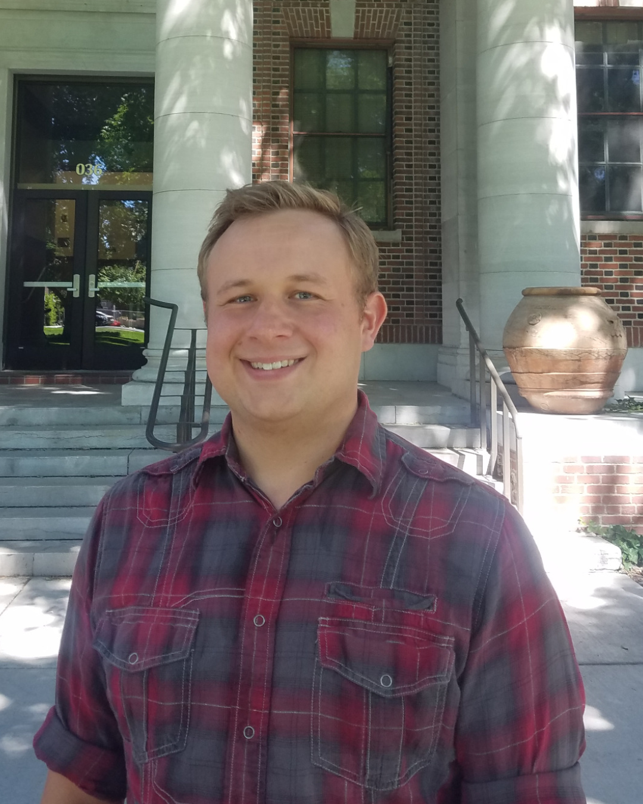

 

  

  <h2 style="panel-title; ">
  ...as a Scientist
  </h2>
  

  

   
  I am a computational chemist who specializes on using molecular modeling to examine biochemical and inorganic systems.    
  Currently, I am a postdoc researcher in the lab of <a href="https://www.unr.edu/cme/people/david-cantu">Dr. David Cantu</a> at the University of Nevada, Reno located in the <a href="https://www.kunr.org/local-stories/2017-08-01/how-did-the-biggest-little-city-get-its-name">Biggest Little City in the World</a>. My principle research is on simulating solution structures of 
  lanthanide-ligand coordination complexes.    
  Before joining the Cantu lab, I completed my PhD under <a href="https://www.memphis.edu/chem/people/faculty/deyonker.php">Dr. Nathan DeYonker</a> at the University of Memphis located in my hometown
  of Memphis, Tennessee. While in the DeYonker lab, I worked on modeling enzyme-catalyzed reactions and using cheminformatic techniques to examine protein inter-residue interactions.    
  <i class="fa-regular fa-file"></i> <a href="CV.pdf#" class="download"> Curriculum Vitae (April 2023)</a>  
  <i class="fa-brands fa-orcid"></i> ORCiD: <a href="https://orcid.org/0000-0002-4243-6078">0000-0002-4243-6078</a>  
  <i class="fa-brands fa-github"></i> GitHub: <a href="https://github.com/tsmmers1">github.com/tsmmers1</a>  
  <i class="fa-brands fa-twitter"></i> Twitter: <a href="https://twitter.com/tjs_summers"> @tjs_summers </a>  
  
 
 
<ul class="list-group" style="float:left; width:49%">
   <a class="list-group-item active" style="background-color:#309143; font-size:120%; text-align:center">
    Skills
  </a>
  <li class="list-group-item">
    Programming: Python, R, C++
  </li>
  <li class="list-group-item">
    QM Software: <i> CP2K, Gaussian, ORCA, PSI4, Q-Chem </i>
  </li>
  <li class="list-group-item">
    MM & MD Software: <i> AMBER, GROMACS, MOE </i>
  </li>
  <li class="list-group-item">
    EXAFS computation
  </li>
  <li class="list-group-item">
    Machine Learning
  </li>  
</ul>
 
<ul class="list-group" style="float:right; width:49%">
   <a class="list-group-item active" style="background-color:#309143; font-size:120%; text-align:center">
    Interests
  </a>
  <li class="list-group-item">
    Protein modeling
  </li>
  <li class="list-group-item">
    QM effects in enzyme catalysis
  </li>
  <li class="list-group-item">
    Lanthanide complex modeling
  </li>
  <li class="list-group-item">
    Molecular structure prediction
  </li>
  <li class="list-group-item">
    Chem/Bioinformatics
  </li>  
</ul>
  

<ul class="list-group" style="float:left; width:49%">
   <a class="list-group-item active" style="background-color:#798d8f; font-size:120%; text-align:center">
    Education
  </a>
  <li class="list-group-item">
    <b>Ph.D. in Chemistry, 2021</b> 
    
 The University of Memphis 

  </li>
  <li class="list-group-item">
    <b>M.S. in Chemistry, 2017</b> 
    
 The University of Memphis 

  </li>
  <li class="list-group-item">
    <b>B.S. in Biochemistry, 2016</b> 
    
 Christian Brothers University 

  </li>
</ul>

<figcaption style="float:right">Memphis-Arkansas Bridge <i>Photo credit: Terrance Raper (tkr92) via Unsplash</i></figcaption>

  

 

  

  <h2 style="panel-title; ">
  ...outside the Lab
  </h2>
  

  

  

  
Habitual Hiker

  

  
Pizza Chef Hobbyist

  

  
Former  <a href="https://www.bbbs.org/">Big Brother</a>

  

  
ASL Student

  

  
Amateur Pianist

  

  
Volunteer at <a href="https://fbnn.org/">FBNN</a> 

  
  

