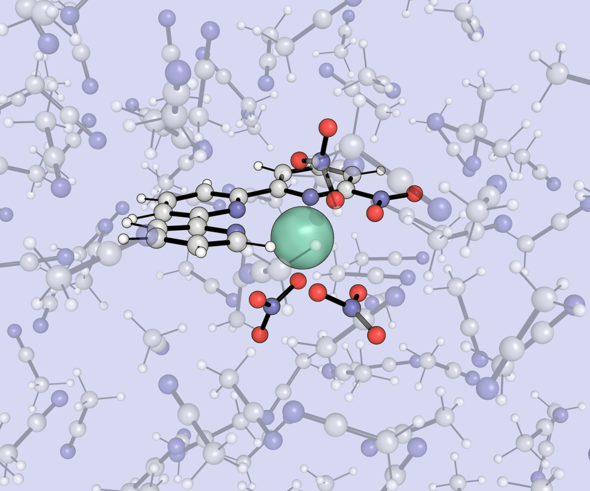
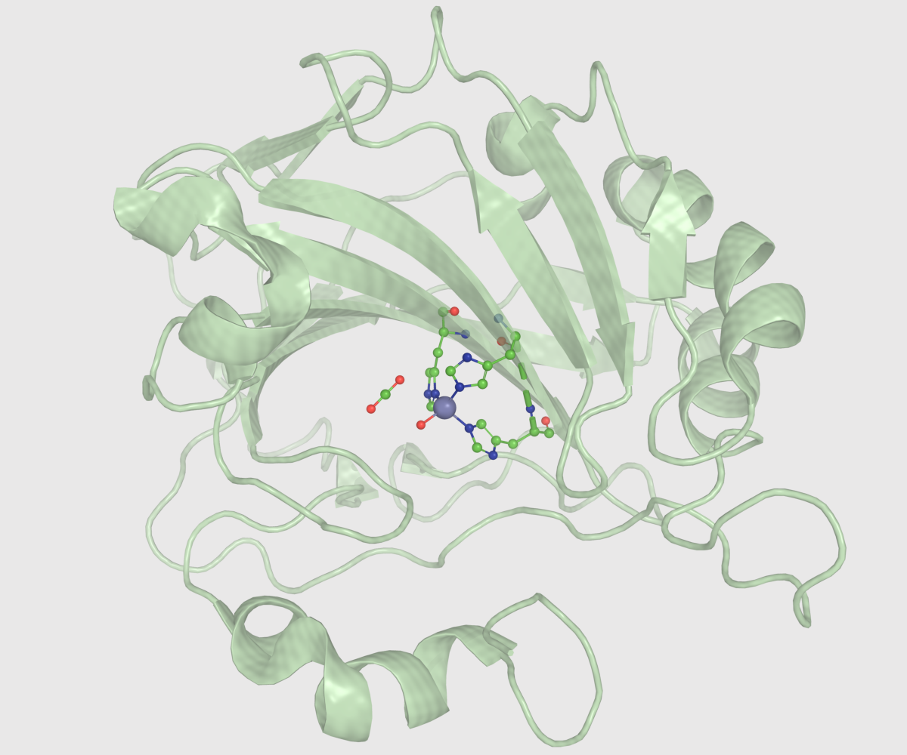
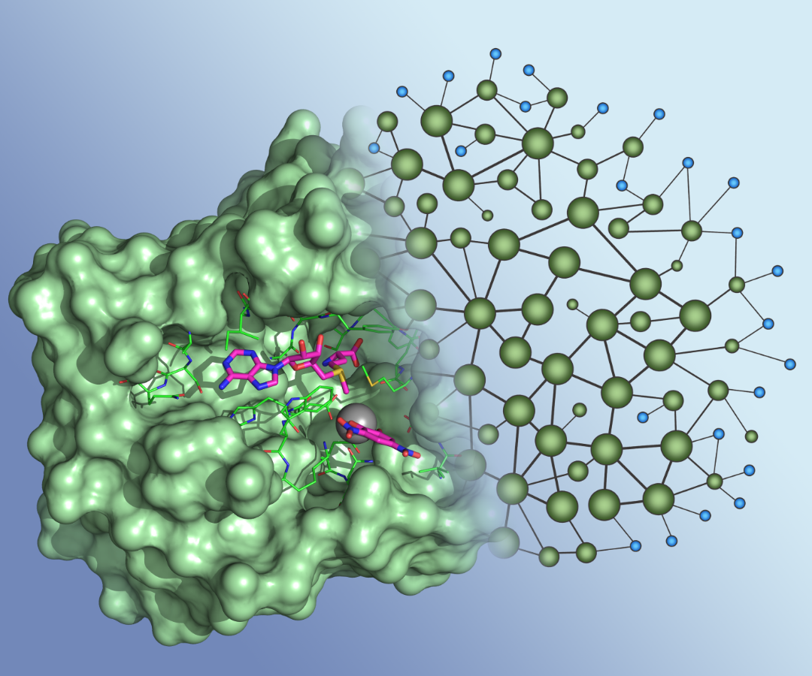

 

  

  <h3 class="panel-title">
  Characterizing Rare Earth Elements in Solution
  </h3>
  

  

  
  Rare earth elements serve as components in a wide array of technologies, including catalysts, phosphors, and magnetic materials. Bonding for rare earth element coordination complexes is typically through electrostatic forces instead of covalent interactions; this leads to geometric configurations that are more irregular and fluxional compared to transition metal coordination complexes. 
     
  Computational (molecular dynamics simulations; global optimization searches) and experimental (X-ray absorption fine structure spectroscopy) methods can be used to resolve the molecular structures an ion-ligand complex will form within solution. Characterizing these solution structures is relevant towards developing materials for lanthanide extraction, medical imaging, molecular magnets, quantum sensors, and other applications. 
  

  

  <h3 class="panel-title">
  Modeling Proteins and Enzyme-catalyzed Reactions
  </h3>
  

  

  
  Proteins and enzymes perform a wide array of functions essential for life and biological actions. Understanding their function and activity often requires investigating the atomic-level forces at play. 
     
  Molecular mechanics modeling can be employed to explore the structure of an entire protein or assembly of proteins. Quantum mechanics modeling is more costly but provides a more accurate representation of chemical reactions and electronic properties. By employing both methods, we can gain insight into the intricate structural and chemical mechanisms underlying protein function and enzyme-catalyzed reactions. 
  

  

  <h3 class="panel-title">
  Discerning Chemical Properties from Molecular Structure
  </h3>
  

  

  
  Protein structures are commonly described in terms of their biological "building blocks", the amino acids. From a chemical viewpoint, it can be more relevant to instead view protein structure in terms of main chain (the peptide linkage between amino acids) and side chain (the R-group of each amino acid) functional groups.
     
  Coupling this approach with graph theory, a protein's 3D structure can be translated into a 2D network of main/side chains (nodes) interconnected (by edges) when there is a chemical interaction occurring between them. We explore the efficiency and accuracy of different methods for designing these networks, along with applying machine learning models to predict chemical properties from these protein graphs.
  

